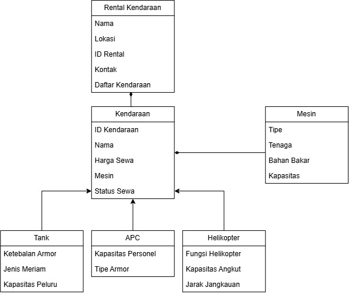
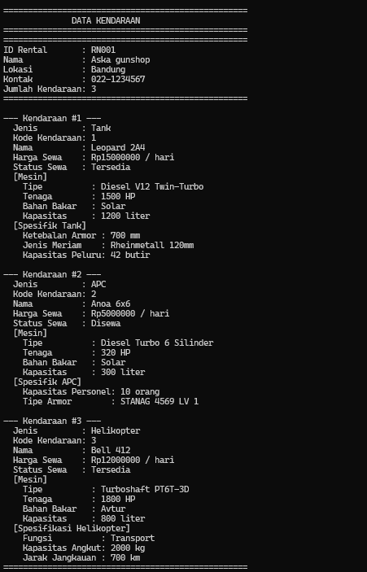
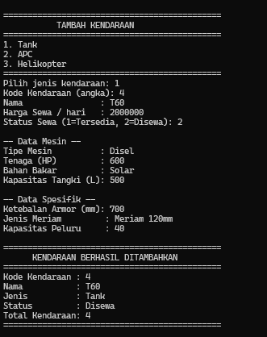
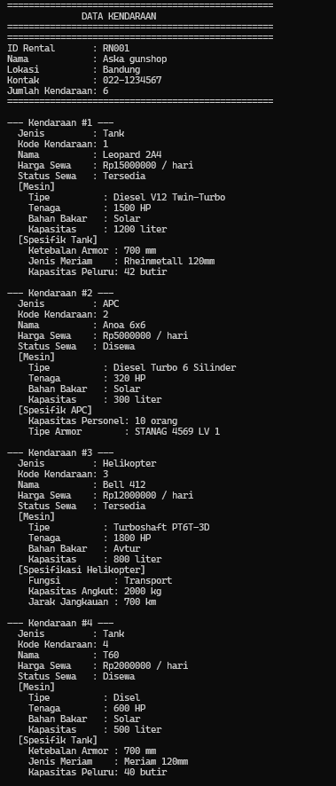

# TP1DPBO2526C3

## Janji

Saya Nabil Azka Saputra dengan NIM 2507096 mengerjakan TP2 dalam mata kuliah DPBO untuk keberkahanNya maka saya tidak melakukan kecurangan seperti yang telah dispesifikasikan. Aamiin

---

## Desain Diagram Program

 

### Keterangan Relasi

1. **Inheritance / Generalization**  
   Digambarkan dengan panah segitiga kosong dari kelas turunan menuju kelas induk.

   - `Tank` merupakan turunan dari `Kendaraan`.
   - `APC` merupakan turunan dari `Kendaraan`.
   - `Helikopter` merupakan turunan dari `Kendaraan`.

2. **Composition**  
   Digambarkan dengan diamond hitam (`◆`) pada sisi komposit.

   - `RentalKendaraan` merupakan **komposit**, sedangkan `Kendaraan` merupakan **komponen**.
   - `Kendaraan` merupakan **komposit**, sedangkan `Mesin` merupakan **komponen**.

3. **Array of Object**  
   Kelas `RentalKendaraan` memiliki atribut `daftarKendaraan` berupa kumpulan objek `Kendaraan`. Pada C++ kumpulan data dapat menggunakan `vector`, sedangkan pada Python dapat menggunakan `list`.

---

# Penjelasan Kelas

## 1. RentalKendaraan

`RentalKendaraan` merupakan kelas utama yang berfungsi sebagai pengelola data seluruh kendaraan yang terdapat pada sistem rental.

### Atribut

- **nama**  
  Menyimpan nama rental kendaraan.

- **lokasi**  
  Menyimpan lokasi rental.

- **idRental**  
  Menyimpan identitas unik dari rental.

- **kontak**  
  Menyimpan informasi kontak rental.

- **daftarKendaraan**  
  Menyimpan kumpulan objek `Kendaraan` yang dikelola oleh rental. Atribut ini digunakan sebagai **Array of Object**.

### Methods

- **tambahKendaraan()**  
  Menambahkan objek kendaraan baru ke dalam `daftarKendaraan`.

- **hapusKendaraan()**  
  Menghapus data kendaraan berdasarkan identitas kendaraan.

- **cariKendaraan()**  
  Mencari kendaraan berdasarkan ID atau informasi tertentu.

- **tampilkanSemuaKendaraan()**  
  Menampilkan seluruh data kendaraan yang tersimpan pada rental.

- **jumlahKendaraan()**  
  Mengembalikan jumlah kendaraan yang terdapat pada `daftarKendaraan`.

---

## 2. Kendaraan

`Kendaraan` merupakan **parent class** sekaligus kelas dasar untuk berbagai jenis kendaraan militer. Kelas ini menyimpan atribut dan method yang bersifat umum untuk seluruh kendaraan.

### Atribut

- **idKendaraan**  
  Identitas unik kendaraan.

- **nama**  
  Nama kendaraan.

- **hargaSewa**  
  Harga sewa kendaraan.

- **mesin**  
  Objek dari kelas `Mesin` yang menjadi bagian dari kendaraan.

- **statusSewa**  
  Menunjukkan kondisi kendaraan, misalnya tersedia atau sedang disewa.

### Methods

- **getInfo()**  
  Menampilkan informasi umum kendaraan.

- **hitungBiaya()**  
  Menghitung biaya sewa kendaraan berdasarkan durasi.

- **setStatusSewa()**  
  Mengubah status sewa kendaraan.

- **tampilkanMesin()**  
  Menampilkan informasi mesin yang digunakan kendaraan.

---

## 3. Mesin

`Mesin` merupakan kelas yang menggambarkan mesin yang dimiliki oleh suatu kendaraan. Dalam desain ini, `Mesin` merupakan **komponen** dari `Kendaraan`.

### Atribut

- **tipe**  
  Menyimpan tipe mesin.

- **tenaga**  
  Menyimpan besarnya tenaga mesin.

- **bahanBakar**  
  Menyimpan jenis bahan bakar yang digunakan.

- **kapasitas**  
  Menyimpan kapasitas mesin.

### Methods

- **getInfo()**  
  Menampilkan informasi lengkap mengenai mesin.

---

## 4. Tank

`Tank` merupakan **child class** dari `Kendaraan`. Kelas ini mewakili kendaraan militer jenis tank dan memiliki atribut khusus yang tidak terdapat secara umum pada kelas `Kendaraan`.

### Atribut

- **ketebalanArmor**  
  Menyimpan ketebalan armor kendaraan.

- **jenisMeriam**  
  Menyimpan jenis meriam yang digunakan.

- **kapasitasPeluru**  
  Menyimpan kapasitas amunisi yang dapat dibawa.

### Methods

- **getInfo()**  
  Menampilkan informasi umum tank beserta informasi khusus tank.

- **hitungBiaya()**  
  Menghitung biaya sewa tank berdasarkan durasi dan aturan biaya yang ditentukan program.

---

## 5. APC

`APC` (*Armored Personnel Carrier*) merupakan **child class** dari `Kendaraan`. Kelas ini digunakan untuk merepresentasikan kendaraan lapis baja pengangkut personel.

### Atribut

- **kapasitasPersonel**  
  Menyimpan jumlah personel yang dapat diangkut.

- **tipeArmor**  
  Menyimpan jenis armor yang digunakan.

### Methods

- **getInfo()**  
  Menampilkan informasi umum APC serta atribut khusus APC.

- **hitungBiaya()**  
  Menghitung biaya sewa APC berdasarkan durasi.

---

## 6. Helikopter

`Helikopter` merupakan **child class** dari `Kendaraan` yang digunakan untuk merepresentasikan kendaraan militer udara.

### Atribut

- **fungsiHelikopter**  
  Menjelaskan fungsi utama helikopter.

- **kapasitasAngkut**  
  Menyimpan kapasitas angkut.

- **jarakJangkauan**  
  Menyimpan jangkauan operasional helikopter.

### Methods

- **getInfo()**  
  Menampilkan informasi umum helikopter dan data khusus helikopter.

- **hitungBiaya()**  
  Menghitung biaya sewa helikopter berdasarkan durasi.

---

# Desain Program

## 1. Hierarchical Inheritance

Desain program menggunakan **hierarchical inheritance** karena terdapat satu parent class, yaitu `Kendaraan`, yang memiliki beberapa child class, yaitu `Tank`, `APC`, dan `Helikopter` mewarisi atribut serta method umum dari `Kendaraan`, kemudian masing-masing memiliki atribut khusus sesuai jenis kendaraannya. Dengan desain ini, data umum seperti ID, nama, harga sewa, mesin, dan status tidak perlu ditulis ulang pada setiap kelas turunan.

---

## 2. Composition

Program menerapkan **composition** pada dua hubungan.

### RentalKendaraan → Kendaraan

`RentalKendaraan` menjadi komposit karena menyimpan dan mengelola kumpulan objek `Kendaraan` melalui `daftarKendaraan`.

### Kendaraan → Mesin


`Mesin` menjadi bagian dari `Kendaraan`. Setiap kendaraan memiliki objek mesin yang digunakan untuk menyimpan informasi mesin kendaraan tersebut.

---

## 3. Array of Object

`RentalKendaraan` memiliki atribut:

```text
daftarKendaraan
```

Atribut tersebut digunakan untuk menyimpan banyak objek kendaraan dalam satu kumpulan.

Contoh data:

```text
daftarKendaraan
├── Tank T-90
├── APC M113
├── Helikopter
└── Tank Leopard
```

Pada C++, konsep ini dapat diimplementasikan menggunakan `vector`. Pada Python, dapat menggunakan `list`.

---

# Alur Program

Alur program dibuat sama untuk seluruh bahasa yang digunakan.

### 1. Inisialisasi

Program membuat objek `RentalKendaraan` sebagai objek utama.

### 2. Membuat Data Awal

Program membuat beberapa objek kendaraan, misalnya `Tank`, `APC`, dan `Helikopter`. Setiap kendaraan memiliki objek `Mesin` sebagai komponennya.

### 3. Menambahkan Kendaraan ke Rental

Objek kendaraan dimasukkan ke dalam `daftarKendaraan` milik `RentalKendaraan`.

### 4. Menampilkan Data Awal

Program menampilkan seluruh kendaraan yang sudah tersedia sebelum dilakukan penambahan data.

### 5. Menambahkan Data Baru

Program membuat satu atau lebih objek kendaraan baru kemudian memasukkannya ke dalam `daftarKendaraan`.

### 6. Menampilkan Data Setelah Penambahan

Program menampilkan kembali seluruh data kendaraan sehingga perubahan sebelum dan sesudah penambahan dapat terlihat.

### 7. Program Selesai

Program berakhir setelah seluruh data berhasil ditampilkan.

---

# Contoh Data

Berikut contoh data kendaraan yang dapat digunakan dalam program:

| Jenis | Nama | Harga Sewa | Status |
|---|---|---:|---|
| Tank | T-90 | Rp10.000.000/hari | Tersedia |
| APC | M113 | Rp5.000.000/hari | Tersedia |
| Helikopter | Black Hawk | Rp15.000.000/hari | Disewa |

Contoh mesin:

| Kendaraan | Tipe Mesin | Tenaga | Bahan Bakar |
|---|---|---:|---|
| T-90 | Diesel | 1.000 HP | Solar |
| M113 | Diesel | 600 HP | Solar |
| Black Hawk | Turboshaft | 1.800 HP | Avtur |

---

# Dokumentasi

## Python

### Sebelum Penambahan Data


### Sesudah Penambahan Data

> Tambahkan screenshot hasil program Python setelah data kendaraan ditambahkan.




---

## C++

### Sebelum Penambahan Data

> Tambahkan screenshot hasil program C++ di sini.

```text
[ Screenshot C++ - Data Awal ]
```

### Sesudah Penambahan Data

> Tambahkan screenshot hasil program C++ setelah data kendaraan ditambahkan.

```text
[ Screenshot C++ - Data Setelah Penambahan ]
```

---

